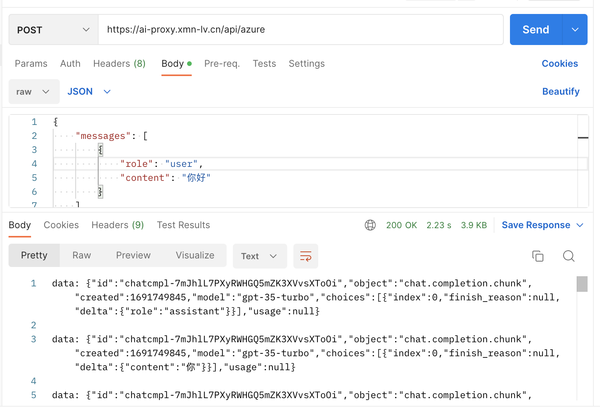

# openai-proxy-vercel

openai-proxy-vercel 是一个解决与 OpenAI 对接速度慢的开源项目，它主要包含两个方面的优化：CDN 加速和 Stream 传输。通过使用 CDN 加速和 Stream 传输，我们可以更快地接入 OpenAI 服务。此项目使用 Vercel 平台提供的 CDN 服务，将数据分布到全球多个节点上，从而实现网页访问的加速。而 Stream 传输则是 OpenAI 提供的一种流式数据传输模式，可以加速对接 OpenAI 服务，减少响应时间。

## 本地运行

1、将.env.example 重命名为 `.env.local`，将 OPENAI_API_KEY、AZURE_OPENAI_API_KEY、AZURE_OPENAI_API_VERSION 替换为您的真实密钥。

2、使用的 npm 版本为 v18.17.0，推荐使用 nvm 安装 v18.17.0 版本

```bash

nvm install v18.17.0

nvm use v18.17.0

```

3、在命令行中运行应用程序，它将在 `http://localhost:3000` 上可用。

```bash
pnpm install

pnpm dev
```

## 一键部署 Vervel

1. Fork 本项目到您的 Github 账户下。

2. 前往 Vercel 官网 https://vercel.com ，单击右上角的 “Sign Up” 按钮注册一个账户，或者使用 Github, GitLab 或者 Bitbucket 的账户登录。

3. Vercel 授权 Github Flow 访问您的账户，让 Vercel 能够访问您的代码并部署您的应用。

4. 您可以通过在 Vercel 应用中选择“Add New Project”来检索您的 Github 或 GitLab 仓库，选择您 fork 过来的项目。


5. 配置 Vercel 应用的环境变量。

如果直接使用 OpenAI 官方的 API，只需要配置 OPENAI_API_KEY

如果使用微软 azure 的 OpenAI 服务，需要配置 AZURE_OPENAI_BASE_URL、AZURE_OPENAI_API_KEY、AZURE_OPENAI_API_VERSION


6. 部署您的项目并等待 Vercel 完成构建和部署，部署完成后，在首页会看到“Success Run OpenAI Proxy！！！”


## 配置你的国内域名

将你的 国内域名 CNAME 到 Vercel 平台，享受高速的 OpenAI 服务吧！

如何配置国内域名：https://juejin.cn/post/7222558002909085756

## 如何使用代理服务

1、使用 OpenAI 的代理服务，只需将路径设置为 "/api/openai"即可，如下在 PostMan 中测试。


2、使用 Azure OpenAI 的代理服务，只需将路径设置为 "/api/azure"即可，如下在 PostMan 中测试。



## 贡献

本项目由「AI 应用大爆炸」社群进行维护，这个项目是独立的，并且和任何其他组织或公司没有关联。

如果您想为这个项目做出贡献，您可以：

- 向 Issue 队列中添加新问题或修复现有问题。

- 贡献代码，提交 PR。

- 加入我们社群，创造更多的价值，获取更多的回报，扫描下方二维码，回复“进群”。


